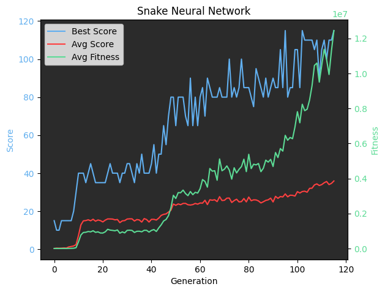
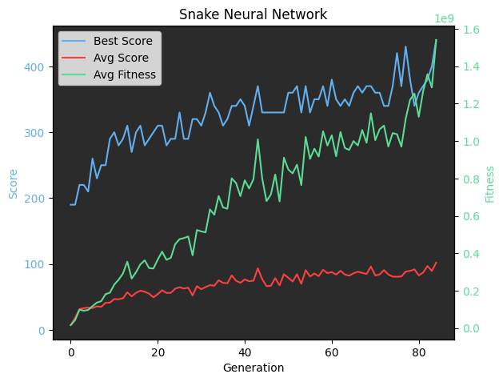

# Using a Genetic Algorithm to Evolve Neural Networks in Snake

This project uses a genetic algorithm (GA) to train a neural network (NN) to play Snake. The described setup surprisingly worked well on the first try, easily solving the 10x10 snake game.

## Performance & Setup

-   **Model:** Simple Feedforward NN (24 inputs -> 24 hidden neurons (ReLU) -> 3 outputs)
-   **GA Params:** Population 500, Starting Mutation Rate 0.01 (decays towards 0)
-   **Training Time:** Converges on a 10x10 grid in ~2 minutes on an M4 Macbook Air (around 2 generations/sec initially, slowing down as snakes get longer and games last longer).

The learning process shows distinct phases:
1.  Initial random movements.
2.  Learning basic survival and food seeking.
3.  Hitting a complexity wall around score 35 (length 40), where the snake becomes long enough to trap itself in the 10x10 grid.
4.  Overcoming self-trapping, leading to rapid convergence towards optimal play.

## Key Insights & Design Choices

While many standard hyperparameters weren't overly sensitive, the input/output encoding and a few GA settings were critical for fast learning.

### 1. Input Encoding: Relative & Rotated Distances

Giving the NN raw coordinates for its head and the food performed poorly. Instead, providing processed environmental information worked much better:

-   **Features:** Inverse distance to the nearest Food, Wall, and Body segment in 8 directions (including diagonals). This results in \( 8 \times 3 = 24 \) inputs.
-   **Distance Encoding:** Inverse distance \( 1/d \) normalized by grid size (0=farthest, 1=closest).
-   **Wall/Body Danger Signal:** For Walls and Body parts, the sign of the inverse distance is *flipped* for distances greater than 1. This creates a sharp signal difference between "immediately adjacent danger" (distance 1) and "nearby obstacle" (distance 2+), which the GA picks up easily. This isn't needed for food, as closer is always better.
-   **Input Rotation:** Critically, these 24 inputs are *rotated* based on the snake's current direction. This means the input features corresponding to "directly in front", "front-left", "directly left", etc., are always in the same indices from the NN's perspective, regardless of the snake's absolute direction on the grid. This prevents the NN from having to constantly re-learn spatial orientations.

This really is critical. Worse input encodings sometimes struggle to get even past collecting 3+ food consistently.

### 2. Output Simplification: Relative Actions

Instead of 4 outputs (North, South, East, West), the NN has only 3 outputs:
-   Turn Left (relative to current direction)
-   Go Straight
-   Turn Right (relative to current direction)

This simplifies the decision-making process and inherently prevents the impossible "move backward" action.

### 3. Activation Function: ReLU is King

Using the ReLU activation function in the hidden layer provided a *massive* speedup compared to other activations tried, moving from unreliable convergence in ~400+ generations to consistent solves very quickly.

### 4. Genetic Algorithm Tuning

-   **Mutation Rate:** Keep it low. Starting at 1% (0.01) and decaying towards a minimum of 0 works well. Rates significantly higher than 1% hinder performance.
-   **Population Size:** Around 500 seems to be a good sweet spot between genetic diversity and computation speed per generation.
-   **Fitness Function:** Using a super-linear fitness function (e.g., score squared or cubed) significantly helps, as it strongly favors selecting the best-performing individuals for reproduction.
-   **Move Limit:** A limit on the number of moves allowed between eating food pellets is essential. Without it, snakes quickly learn "cheese" strategies, like looping in place indefinitely to survive without seeking food, or moving in a scanning pattern that loops after visiting all squares, which trivially solves the game and is boring. This limit resets each time food is eaten.

## Why Scores Can Exceed 100 in a 10x10 Grid

Two reasons:

1.  **Growth Mechanic:** When the snake eats, it grows "out of its tail". The head continues moving, but the tail segment stays put for a number of steps equal to the points gained.
2.  **Accelerated Growth:** To speed up learning (reaching critical length/score breakpoints faster), eating one food item grants 5 points (and thus adds 5 length). This doesn't change the game's strategic difficulty, just the pace of progression.

Combined, especially late-game when the snake fills most of the board, food often spawns directly in its path. The snake can then consume multiple food items in quick succession, rapidly increasing its score and length past the nominal 100 grid cells before inevitably running out of space. (Starting length is 5, so the effective cap without this effect would be 95).

## Note on Replays

When using the replay functionality, ensure the "points per food" parameter matches the value used during training. Otherwise, the snake's length in the replay won't match the trained behavior.

## Result & Transferability

It's exciting how effectively this combination of techniques works. An extremely simple NN (24-24-3) consistently learns to play Snake near-perfectly on a 10x10 grid within just a couple of minutes of evolution.

Furthermore, thanks to the relative and rotated input encoding, a model trained on a small grid generalizes remarkably well to larger grids with potentially minimal additional training. This suggests an efficient training strategy:

1.  Train on a small grid (e.g., 10x10) where the self-trapping complexity barrier is reached relatively quickly.
2.  Once converged, transfer the same trained model to a larger grid. It should perform well immediately and require significantly less training time to fully adapt compared to training on the large grid from scratch.

### Using models that solved 10x10 to init 20x20

